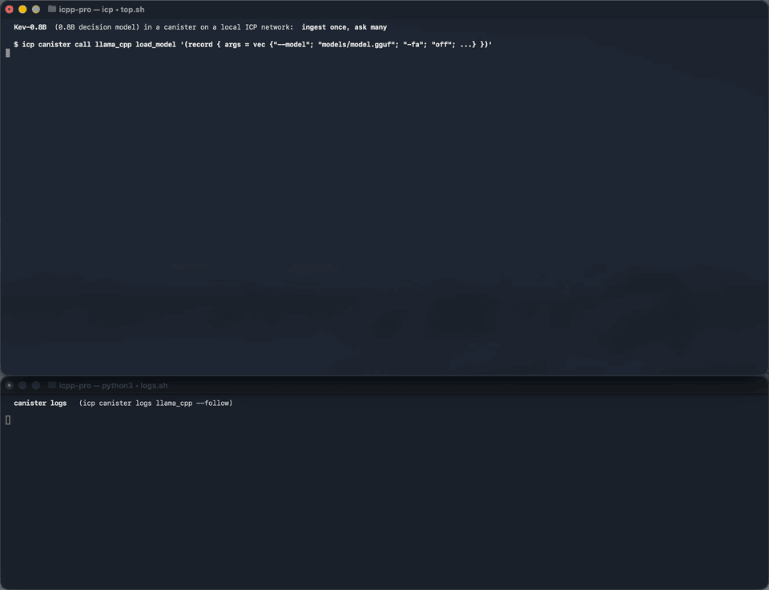

# Kev-0.8B (decision model, 0.8B, English, stored state)

> **Kev-0.8B** is an English **decision model**: it answers typed questions (`choice`,
> `score`, yes/no `noul`) about a state with probabilities, without generating text.
> Base model Qwen3.5-0.8B-Base (causal, 24 layers: 18 Gated DeltaNet + 6 attention) with
> a pointer head, Apache 2.0, source
> [jaredpalmer/kev-0.8b](https://huggingface.co/jaredpalmer/kev-0.8b), GGUF
> [ggml-org/Kev-0.8B-GGUF](https://huggingface.co/ggml-org/Kev-0.8B-GGUF).
>
> Background: [README-decision-models.md](README-decision-models.md) explains what decision
> models are, the `run_decision` interface, and how a request is answered.
>
> It runs on the **same `llama_cpp` canister** as the chat models.



_The demo below, recorded on a local network: top, the calls; bottom, the canister log.
The storing calls are shown at 4x speed._

# Ingest once, ask many

Julia-1 and Laya read the whole question + options + state in one forward pass, which
must fit in one update call. Kev is different: it is causal and its prompt starts with
the state, so the state is a prefix that does not depend on the question.

`run_decision` therefore stores the state per caller:

1. The first calls of a request **ingest the state**, ~24 tokens per call, into a
   session file, exactly like `run_update` ingests a long prompt. The reply shows the
   progress: `state_tokens` and `state_tokens_remaining`.
2. Once it is stored, every call **answers questions** from it: each question decodes only
   its own tokens (instructions + options), never the state again.
3. A **later request about the same state** (other questions) starts answering right
   away: the state is still stored.
4. A **grown state** (the stored state with new data appended) continues from the
   stored one: only the new tokens are ingested.

You re-send the same request until `pending` is empty, as for the other decision models.

# Headline results

Measured on a local network (the same 40 B instruction limit per update call as
mainnet), llama_cpp_canister v0.21.0 (llama.cpp b11476):

| Measure                         | Value                                                                               |
|---------------------------------|-------------------------------------------------------------------------------------|
| gguf                            | Kev-0.8B-Q8_0.gguf, 812,406,304 bytes                                               |
| heap after `load_model`         | ~1.2 GB (`-c 4096`, f32 KV cache), also while states are stored and used            |
| instructions per state token    | ~1.4 B (1.60 B at 2,000 tokens): **24 state tokens stored per call**                |
| instructions per question token | ~1.42 B: **~22 tokens per question** without the state (~18 on a 2,000-token state) |
| stored state                    | ~20 MB + ~24 KB per state token; ~1.5 B to save, ~1-2 B to load                     |
| max state size                  | ~4,000 tokens: `-c 4096` holds the state plus one question (measured up to 2,000)   |
| `max_tokens_update`             | 0: each call stops itself before the IC's instruction limit                         |
| accuracy vs llama-server (CPU)  | within 0.013 on every probability                                                   |

# Quality

Kev-0.8B is the smallest Kev. Its model card says it is markedly less accurate than Kev-4B:
0.697 on out-of-domain questions, and 0.851 on CFPB complaint documents. It was trained on
classification and routing data (banking intents, reviews, news, NLI, safety, consumer
complaints), so it is good at **extracting facts from support-style text**: which product,
which issue, is a refund asked, is this a repeat report. It is weak at applying a stated
multi-step policy, and its card puts financial decisions (such as trading) out of scope.

The demo follows from that: Kev extracts the facts, and the application's own code applies
the policy. Test it on your own questions, and choose confidence thresholds for it; they
differ per decision model.

# The demo: a DEXSwapper support ticket

DEXSwapper is a fictional DEX on the Internet Computer. A user's swap of 500 ICP to ckUSDC
failed: the ICP left the wallet, no ckUSDC arrived. The support desk asks Kev-0.8B five
questions about the ticket. Two days later the user writes again; the message is appended
to the ticket, and two questions are asked again. The desk's policy, in code: escalate to
the support lead when a user reports the same issue a second time.

Every command below was run as shown, on a fresh canister; the outputs are the real ones.

## Set up

- Follow the [Set up](README.md#set-up) of the main README up to and including **Deploy
  the wasm to a canister on the local network** (icp-cli, an identity, the repo or the
  release, the Python environment, the wasm). Then continue here.

- Ensure the canister has enough cycles. Uploading 812 MB and the decision calls consume
  cycles:

  ```bash
  icp canister top-up llama_cpp --amount 20000000000000 -e local
  ```

- Raise the canister's wasm memory limit (recommended).

  With the load args below, the heap stays at ~1.2 GB, also while states are stored and
  questions answered. That fits within a new canister's default `wasm_memory_limit` of
  3 GiB. We recommend raising it to 3.75 GiB anyway, as for the other models: it leaves
  headroom for a larger `--ctx-size` or `--ubatch-size`.

  ```bash
  icp canister settings update llama_cpp --wasm-memory-limit 4026531840 -e local

  # verify
  icp canister status llama_cpp -e local | grep "Wasm memory limit"
  ```

## Upload the gguf

- Download the model from Hugging Face: https://huggingface.co/ggml-org/Kev-0.8B-GGUF

  Store it in: `models/ggml-org/Kev-0.8B-GGUF/Kev-0.8B-Q8_0.gguf`

  ```bash
  mkdir -p models/ggml-org/Kev-0.8B-GGUF
  curl -L -C - -o models/ggml-org/Kev-0.8B-GGUF/Kev-0.8B-Q8_0.gguf https://huggingface.co/ggml-org/Kev-0.8B-GGUF/resolve/main/Kev-0.8B-Q8_0.gguf
  ```

  After download, verify the sha256 hash:

  ```bash
  $ shasum -a 256 models/ggml-org/Kev-0.8B-GGUF/Kev-0.8B-Q8_0.gguf
  27278f34eb3273bceea4c053dc50dd61a5161da21a718c4aacdf8fd5830771d0
  ```

- Upload the gguf file to the canister:

  ```bash
  python -m scripts.upload --network local --canister llama_cpp --canister-filename models/model.gguf --filetype gguf --hf-sha256 "27278f34eb3273bceea4c053dc50dd61a5161da21a718c4aacdf8fd5830771d0" models/ggml-org/Kev-0.8B-GGUF/Kev-0.8B-Q8_0.gguf
  ```

- Check the filesize & sha256 of the uploaded gguf file in the canister:

  ```bash
  icp canister call llama_cpp -e local uploaded_file_details '(record {
    filename = "models/model.gguf"
  })'
  ```

  Which returns:

  ```
  (
    variant {
      Ok = record {
        filename = "models/model.gguf";
        filesize = 812_406_304 : nat64;
        filesha256 = "27278f34eb3273bceea4c053dc50dd61a5161da21a718c4aacdf8fd5830771d0";
      }
    },
  )
  ```

## Load the model

- Load the gguf file into Orthogonal Persisted (OP) working memory:

  ```bash
  icp canister call llama_cpp -e local load_model '(record {
    args = vec {
      "--model"; "models/model.gguf";
      "--no-warmup";
      "--ctx-size"; "4096";
      "--batch-size"; "64";
      "--ubatch-size"; "64";
      "-fa"; "off";
      "--cache-type-k"; "f32";
      "--cache-type-v"; "f32";
    }
  })'
  ```

  Which returns:

  ```
  (
    variant {
      Ok = record {
        n_prompt_tokens = null;
        output = "Model succesfully loaded into memory.";
        n_tokens_generated = null;
        conversation = "";
        error = "";
        n_prompt_tokens_remaining = null;
        n_prompt_tokens_cached = null;
        status_code = 200 : nat16;
        prompt_remaining = "";
        generated_eog = false;
        n_prompt_tokens_decoded = null;
      }
    },
  )
  ```

  **Why these args for Kev-0.8B?**

  - `-fa off --cache-type-k f32 --cache-type-v f32` keeps the cost of a token almost flat
    as the state grows. Measured instructions per token at 0 / ~550 / ~2,000 state tokens:

    | Attention setup                 | 0 tokens | ~550 tokens | ~2,000 tokens |
    |---------------------------------|----------|-------------|---------------|
    | `-fa off`, f32 KV (recommended) | 1.42 B   | 1.45 B      | 1.60 B        |
    | `-fa off`, f16 KV               | 1.42 B   | 1.76 B      | -             |
    | flash attention on (default)    | 1.42 B   | 2.05 B      | -             |

    The f32 cache makes the stored state bigger (~24 KB per token), which is cheaper than
    the attention it saves.
  - `--ctx-size 4096` sets the largest state plus question: ~4,000 state tokens. It is
    required: the default is the model's training context. Kev was trained on states up to
    7,552 tokens, but a larger `--ctx-size` does not help: beyond ~5,000 tokens (estimated)
    loading and saving the stored state no longer leave room in one call.
  - `--batch-size 64 --ubatch-size 64` keeps the per-call buffers small. A question must
    fit in `--ubatch-size` tokens.
  - Do not pass `-np` / `--parallel`: the stored state needs one sequence.

- Check the memory use:

  ```bash
  icp canister call llama_cpp -e local get_memory_status '()' --query
  ```

  Which returns ~1.2 GB of heap:

  ```
  (
    variant {
      Ok = record {
        wasm_heap_bytes = 1_169_620_992 : nat64;
        stable_bytes = 1_384_185_856 : nat64;
      }
    },
  )
  ```

## Set the per-call token budget

```bash
icp canister call llama_cpp -e local set_max_tokens '(record {
  max_tokens_query = 0 : nat64;
  max_tokens_update = 0 : nat64
})'
```

For Kev, `0` (no token cap) is the best setting: each call measures its own cost and stops
before the IC's 40 B instruction limit, storing as much of the state and answering as many
questions as fit. A non-zero `max_tokens_update` caps the tokens per call on top of that. A
question that cannot fit in one call, even on its own, returns `Err`.

## Day 1: the ticket arrives, five questions

The state is the ticket: the wallet, the failed swap, and the user's message. The
questions extract the facts the support desk acts on.

Repeat this call until `pending` in the response is empty. Keep sending the same request:
the first calls store the state (watch `state_tokens_remaining` count down), then each call
answers questions from the stored state.

```bash
icp canister call llama_cpp -e local run_decision '(record {
  state = variant { Text = "DEXSwapper support ticket 7741. Wallet: 3vx2k-...-cae, user since 2024, 312 swaps, no open tickets.\nSwap, March 3, 14:02 UTC: 500 ICP -> ckUSDC on the ICP/ckUSDC pool, quote 4,180 ckUSDC, slippage 0.5%. 500 ICP left the wallet; the swap status shows failed, price moved; 0 ckUSDC received.\nUser message, March 3: My swap failed but the 500 ICP is gone from my wallet and I got no ckUSDC. Please refund the 500 ICP to my wallet." };
  questions = vec {
    record { id = "product"; kind = variant { choice }; instructions = "Which product?" };
    record { id = "issue"; kind = variant { choice }; instructions = "Which issue?" };
    record { id = "refund"; kind = variant { noul }; instructions = "Is a refund requested?" };
    record { id = "mood"; kind = variant { score }; instructions = "User mood?" };
    record { id = "repeat"; kind = variant { noul }; instructions = "Is this the second report of the same issue?" };
  };
  options = vec {
    record { question_id = "product"; key = "swap"; description = "" };
    record { question_id = "product"; key = "liquidity pool"; description = "" };
    record { question_id = "product"; key = "staking"; description = "" };
    record { question_id = "product"; key = "token listing"; description = "" };
    record { question_id = "issue"; key = "failed swap"; description = "" };
    record { question_id = "issue"; key = "slippage"; description = "" };
    record { question_id = "issue"; key = "wrong token"; description = "" };
    record { question_id = "issue"; key = "listing"; description = "" };
    record { question_id = "mood"; key = "calm"; description = "" };
    record { question_id = "mood"; key = "frustrated"; description = "" };
    record { question_id = "mood"; key = "angry"; description = "" };
  };
})'
```

The calls of this run (cycles measured with `icp canister status`):

| Call | `state_tokens_remaining` | `input_tokens` | Answered this call        | Cycles |
|------|--------------------------|----------------|---------------------------|--------|
| 1    | 143                      | 24             | - (storing the state)     | 35.5 B |
| 2    | 119                      | 24             | - (storing the state)     | 35.5 B |
| 3    | 95                       | 24             | - (storing the state)     | 35.7 B |
| 4    | 71                       | 24             | - (storing the state)     | 36.0 B |
| 5    | 47                       | 24             | - (storing the state)     | 36.1 B |
| 6    | 23                       | 24             | - (storing the state)     | 36.4 B |
| 7    | 0                        | 23             | - (storing the state)     | 35.2 B |
| 8    | 0                        | 20             | product: swap (0.78)      | 29.5 B |
| 9    | 0                        | 21             | issue: failed swap (0.81) | 30.9 B |
| 10   | 0                        | 13             | refund: yes (0.85)        | 19.6 B |
| 11   | 0                        | 18             | mood: 0.95                | 26.6 B |
| 12   | 0                        | 18             | repeat: no (0.43)         | 26.6 B |

The ticket is 167 tokens. Calls 1-7 store it, 24 tokens per call (three steps of 8), and
each stops before the instruction limit. Calls 8-12 answer one question each, from the
stored state; each costs only its own 13-21 tokens.

The reply of the last call has every answer (`probabilities` shortened):

```
(
  variant {
    Ok = record {
      probabilities = vec { ... };
      state_tokens_remaining = opt (0 : nat64);
      pending = vec {};
      answers = vec {
        record {
          id = "product";
          yes = 0.0 : float64;
          kind = variant { choice };
          score = 0.0 : float64;
          choice = "swap";
          confidence = 0.7014694145493338 : float64;
        };
        record {
          id = "issue";
          yes = 0.0 : float64;
          kind = variant { choice };
          score = 0.0 : float64;
          choice = "failed swap";
          confidence = 0.743779889853661 : float64;
        };
        record {
          id = "refund";
          yes = 0.8547947733212934 : float64;
          kind = variant { noul };
          score = 0.0 : float64;
          choice = "";
          confidence = 0.0 : float64;
        };
        record {
          id = "mood";
          yes = 0.0 : float64;
          kind = variant { score };
          score = 0.9519218576880576 : float64;
          choice = "";
          confidence = 0.21746224903389744 : float64;
        };
        record {
          id = "repeat";
          yes = 0.43233558602194266 : float64;
          kind = variant { noul };
          score = 0.0 : float64;
          choice = "";
          confidence = 0.0 : float64;
        };
      };
      input_tokens = 18 : nat64;
      state_tokens = opt (167 : nat64);
    }
  },
)
```

- `product` and `issue` are `choice` questions: `choice` is the most probable option.
- `refund` and `repeat` are `noul` (yes/no) questions: `yes` is the probability of yes.
- `mood` is a `score` question: `score` is the expected level, from 0 (calm) to 2 (angry).

## Day 2: the user writes again

The new message is **appended** to the state, starting with a newline, and the two
questions that can change are asked again. The canister finds the stored state of day 1
as the start of the new one, so it only ingests the new message.

Repeat until `pending` is empty:

```bash
icp canister call llama_cpp -e local run_decision '(record {
  state = variant { Text = "DEXSwapper support ticket 7741. Wallet: 3vx2k-...-cae, user since 2024, 312 swaps, no open tickets.\nSwap, March 3, 14:02 UTC: 500 ICP -> ckUSDC on the ICP/ckUSDC pool, quote 4,180 ckUSDC, slippage 0.5%. 500 ICP left the wallet; the swap status shows failed, price moved; 0 ckUSDC received.\nUser message, March 3: My swap failed but the 500 ICP is gone from my wallet and I got no ckUSDC. Please refund the 500 ICP to my wallet.\nUser message, March 5: Still nothing!! This is the second time I report this swap and nobody answers. This is unacceptable. Give me back my 500 ICP today or I post the transaction on X." };
  questions = vec {
    record { id = "mood"; kind = variant { score }; instructions = "User mood?" };
    record { id = "repeat"; kind = variant { noul }; instructions = "Is this the second report of the same issue?" };
  };
  options = vec {
    record { question_id = "mood"; key = "calm"; description = "" };
    record { question_id = "mood"; key = "frustrated"; description = "" };
    record { question_id = "mood"; key = "angry"; description = "" };
  };
})'
```

The calls of this run:

| Call | `state_tokens_remaining` | `input_tokens` | Answered this call    | Cycles |
|------|--------------------------|----------------|-----------------------|--------|
| 1    | 30                       | 17             | - (storing the state) | 27.8 B |
| 2    | 6                        | 24             | - (storing the state) | 36.5 B |
| 3    | 0                        | 6              | - (storing the state) | 11.6 B |
| 4    | 0                        | 18             | mood: 1.23            | 26.6 B |
| 5    | 0                        | 18             | repeat: yes (0.71)    | 26.6 B |

The new state is 214 tokens. Call 1 loads the stored day-1 state (167 tokens) and only
ingests the new message: after it, 30 of 214 tokens remain. In all, 47 tokens are ingested
instead of 214.

The reply of the last call:

```
(
  variant {
    Ok = record {
      probabilities = vec { ... };
      state_tokens_remaining = opt (0 : nat64);
      pending = vec {};
      answers = vec {
        record {
          id = "mood";
          yes = 0.0 : float64;
          kind = variant { score };
          score = 1.231470499887096 : float64;
          choice = "";
          confidence = 0.4335033796280975 : float64;
        };
        record {
          id = "repeat";
          yes = 0.7094154562086135 : float64;
          kind = variant { noul };
          score = 0.0 : float64;
          choice = "";
          confidence = 0.0 : float64;
        };
      };
      input_tokens = 18 : nat64;
      state_tokens = opt (214 : nat64);
    }
  },
)
```

| Question | Day 1         | Day 2          |
|----------|---------------|----------------|
| mood     | 0.95          | **1.23**       |
| repeat   | **no** (0.43) | **yes** (0.71) |

## Apply the policy in your code

Kev answers the questions; the decision belongs to the application. For example, in the
service that calls the canister:

```python
repeat = answers["repeat"]["yes"]            # p(yes) of the "repeat" question
if repeat > 0.5:
    escalate_to_support_lead(ticket_id=7741)  # DEXSwapper policy: second report
```

On day 1, `repeat` is 0.43: no escalation. On day 2 it is 0.71: the ticket is escalated.

## Watch the canister log

Every step is logged, with its token counts and instructions. The canister keeps only the
most recent records; these are the last two calls of day 2:

```bash
icp canister logs llama_cpp -e local
```

```
llama_cpp: run_decision - request: 2 question(s), Text state of 613 bytes, token budget none
llama_cpp: run_decision - state: loaded 214/214 tokens from .canister_cache/<principal>/sessions/decision-state-<hash>.session, 0.80 B instructions
llama_cpp: run_decision - mood: 18 tokens after the state, 25.59 B instructions (1.42 B per token), scores [-0.42, 4.61, 2.93], softmax T=2.35
llama_cpp: run_decision - mood (score, 18 tokens) -> score 1.23, frustrated (p=0.62, confidence=0.43)
llama_cpp: run_decision - 18 tokens this call, 1/2 questions answered, pending: repeat
llama_cpp: run_decision - request: 2 question(s), Text state of 613 bytes, token budget none, 1 answered by earlier calls
llama_cpp: run_decision - state: loaded 214/214 tokens from .canister_cache/<principal>/sessions/decision-state-<hash>.session, 0.80 B instructions
llama_cpp: run_decision - repeat: 18 tokens after the state, 25.57 B instructions (1.42 B per token), scores [1.15, 3.25], softmax T=2.35
llama_cpp: run_decision - repeat (noul, 18 tokens) -> yes (p(yes)=0.71)
llama_cpp: run_decision - 18 tokens this call, 2/2 questions answered
```

## Optional: expire stored states by age

A caller keeps at most 8 stored states (the oldest is removed first); each is ~20 MB +
~24 KB per state token. Stored states are prompt-cache files, so the
[prompt-cache cleanup timer](README.md#prompt-cache-cleanup-timer) can also remove them.
It is **off by default**. To use it, start it after every install and upgrade, and
optionally set its TTL (default 6 h):

```bash
icp canister call llama_cpp -e local cache_cleanup_start_timer '()'
```

It then deletes a stored state whose last ingestion is older than the TTL; answering
questions does not refresh that time. A removed state is ingested again on the next request
about it.

## Optional: run the smoke tests

`test/test_decision.py` runs the Kev-0.8B checks against the uploaded model: answers
within 0.05 of llama-server, ingestion progress, reuse of a stored state, and a grown
state.

```bash
DECISION_MODEL=kev-0.8b pytest -vv --network local --identity "$(icp identity default)" test/test_decision.py
```

## The same with llama.cpp

This sequence of update calls is equivalent to running `llama-server` locally and posting
the request to its System One endpoint (`POST /v1/systemone`), with the same model. The
canister's answers are within 0.013 of llama-server's (CPU). In the `curl` command below,
replace `...` with the full ticket text:

```bash
<path-to>/llama-server -m models/ggml-org/Kev-0.8B-GGUF/Kev-0.8B-Q8_0.gguf --port 8080
```

```bash
curl -s http://127.0.0.1:8080/v1/systemone -H "Content-Type: application/json" -d '{"state": "DEXSwapper support ticket 7741. ...", "questions": {"repeat": {"type": "noul", "instructions": "Is this the second report of the same issue?"}}}'
```

# Growing states: append, then ask again

Day 2 above is a grown state. Any state that grows as data arrives (a ticket with a new
message, a log with a new day, a game's move list after each move) does not have to be
ingested again. When a request's state is not stored yet, `run_decision` looks for the
caller's stored state with the longest token list that the new state starts with, loads
it, and ingests only the rest. The older state stays stored, so requests about it keep
working.

To make it work:

- **Append, never rewrite.** The new state must start with exactly the old one: for a
  `Text` state, the old text plus the new text; for a `Json` state, new keys or items at
  the end (the key order is kept).
- **Start the new data with a newline,** so the tokens at the old end do not change. If
  they do, the state is ingested from the start: correct, only slower.
- **Send what grows, not a snapshot.** A chess game as its move list grows; a board
  position (FEN) changes in the middle, so nothing can be reused.
- The state stays limited to ~4,000 tokens (`--ctx-size 4096`). For a log that keeps
  growing, start a new state from a recent window now and then.

# What it's good (and not good) for

- **Good:** decisions about a long state: a support ticket with its history, a document,
  an agent's context, asked several questions. The state is processed once per caller,
  and every question then costs one call or less.
- **Good:** many requests about the same state, or a state that grows by appending: each
  update only costs its new tokens.
- **Not good:** one long question: instructions + options must fit in ~22 tokens (keep
  option keys short; descriptions add tokens). A question that cannot fit returns `Err`.
- **Not good:** the most accurate answers on short inputs: use
  [Laya](README-decision-model-Laya.md) there.
- **Not good:** decisions it was not trained for, such as trading. Let Kev extract facts,
  and keep the decision in your code.
